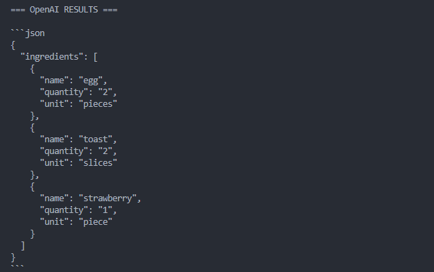
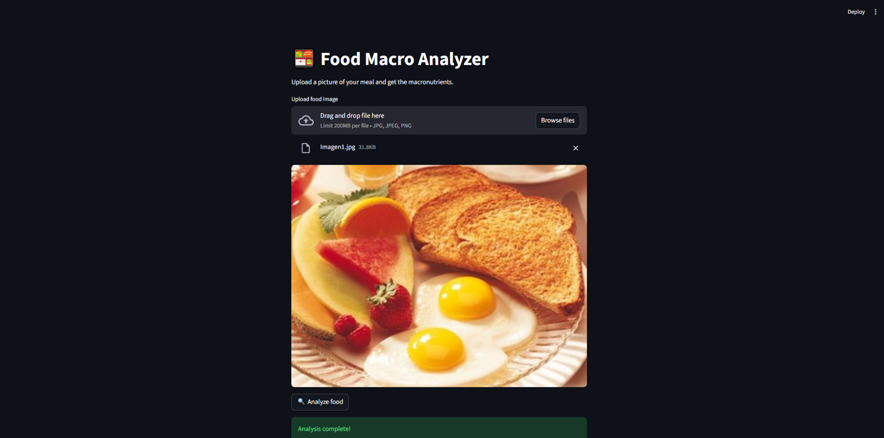
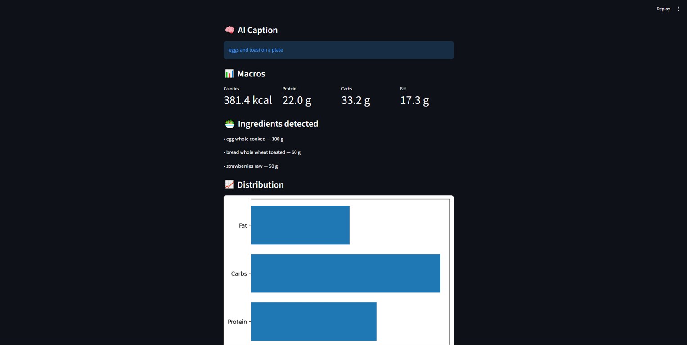

# 🍱 CalorieCalculator – AI Food Macro Analyzer

An AI-powered web application that analyzes food images using Computer Vision to estimate calories and macronutrients automatically.

The system integrates Azure Computer Vision, Azure OpenAI, and USDA nutritional data to transform a simple meal photo into a detailed macro breakdown.

---

## 🚀 Overview

CalorieCalculator is designed to simplify nutritional tracking by eliminating manual food logging. Instead of searching foods individually, users can upload a single image of their meal and receive:

- Detected ingredients
- Estimated calories
- Macronutrient breakdown (protein, carbs, fat)
- Visual macro distribution charts

The project was developed using cloud AI services from Microsoft Azure, combining Computer Vision and large language models.

---

## ☁️ Cloud Architecture

This project was built entirely using Azure AI services:

- Azure Computer Vision → Image analysis
- Azure OpenAI → Food interpretation and normalization
- USDA FoodData Central → Nutritional data lookup

---

## 🧠 Problem Statement

Manual nutrition tracking is tedious and error-prone because users must:

- Search foods individually
- Estimate portion sizes
- Enter macros manually

Traditional computer vision APIs also struggle to accurately interpret complex meals.

This project aims to automate the entire process using AI-driven image understanding.

---

## ⚙️ System Workflow

The application follows a multi-stage AI pipeline:

### 1️⃣ Image Upload
User uploads a meal image through the Streamlit interface.

### 2️⃣ Computer Vision Analysis
Azure Computer Vision processes the image and generates:

- Captions
- Dense captions

### 3️⃣ AI Food Interpretation
Azure OpenAI processes captions to:

- Extract food ingredients
- Normalize food names
- Adjust quantities to grams

### 4️⃣ Nutrition Lookup
Each ingredient is queried against the USDA FoodData Central API.

### 5️⃣ Macro Calculation
Macros are multiplied by portion factors and aggregated.

### 6️⃣ Visualization
Results are displayed in the web interface using charts.

---

## 🧠 Engineering Decisions

### Choosing Caption + Dense Caption Over Tags

During experimentation, multiple Computer Vision outputs were evaluated:

#### Objects Detection
**Limitations:**

- Only detects generic categories like "Food"
- Does not identify specific ingredients

---

#### Tags Results
**Advantages:**

- Sometimes identifies ingredients

**Disadvantages:**

- Low precision
- Contains noisy labels such as:
  - "food"
  - "dish"
  - "meal"

---

#### Caption + Dense Caption (Final Choice)

This approach was selected because:

- Provides contextual descriptions
- Better represents complex meals
- Allows extraction of ingredient information

Dense captions with confidence > 80% were used for improved reliability.

Example output:

> "A plate of sushi rolls with rice and salmon"

This gives a clearer interpretation than isolated tags.

---

### Why Azure OpenAI Was Used

The system uses Azure-hosted OpenAI models because they provide:

- Enterprise-grade reliability
- Secure API integration
- Strong contextual understanding of food images
- Ability to normalize noisy CV outputs into structured ingredient lists

The AI results closely match the actual food content in test images.

---

### Why USDA FoodData Central

The USDA API was chosen because it provides:

- Official nutritional data
- Detailed macro information
- Standardized food entries

After retrieving nutritional values, macros are multiplied by portion factors and aggregated.

---

## ⚠️ Known Limitations

### Portion Size Detection

One major limitation of current Computer Vision technology is:

- Inability to accurately estimate food quantity

For example:

- Cannot distinguish between 1 egg vs 2 eggs
- Cannot measure portion size of rice or pasta

As a result, macro calculations are typically based on standard serving sizes.

---

### Ingredient Detail Limitations

Even with dense captioning:

- Some minor ingredients may be missed
- Mixed foods can be difficult to separate

---

## 📸 Results & Screenshots

### Computer Vision Output


Example showing the results of Computer Vision processing that were used to make the decision to use caption and dense caption.

---

### Azure OpenAI Interpretation


Shows the results returned by gtp-4o after sending the captions. This image was taken before making the normalization changes.

---

### Web Application Interface



- Upload screen
- Detected ingredients
- Macro visualization charts

---

## 🛠️ Tech Stack

### Frontend
- Streamlit

### Backend
- Python

### Cloud AI Services
- Azure Computer Vision
- Azure OpenAI

### Data Sources
- USDA FoodData Central API

### Visualization
- Matplotlib

---

## ✨ Features

- AI-powered food recognition
- Ingredient extraction from images
- Automatic macro calculation
- Cloud-based AI processing
- Interactive nutrition visualization

---

## ⚡ How to Run Locally

### Install dependencies

```bash
pip install streamlit pillow matplotlib
```
### Configure environment variables
Create a `.env` file:
```env
ENDPOINT_VISION=your_endpoint
AZURE_VISION_KEY=your_key  
ENDPOINT_OPENAI=your_endpoint
AZURE_OPENAI_KEY=your_key  
USDA_API_KEY=your_key
```
### Run the app
```bash
streamlit run app.py
```
## Author
**Sebastián Vargas Quesada** Electrical Engineering – Computer & Network Emphasis