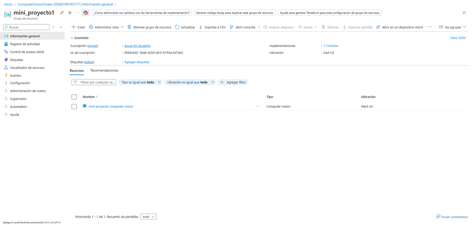
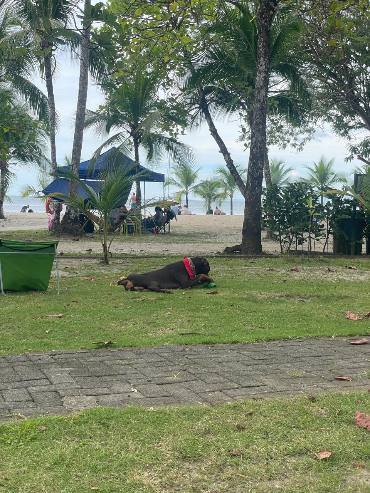
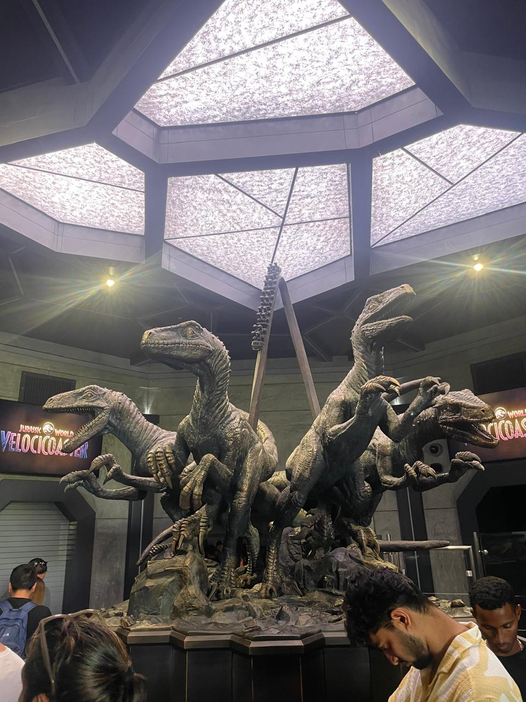
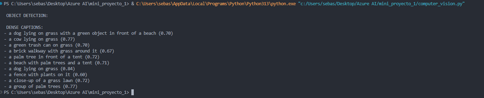
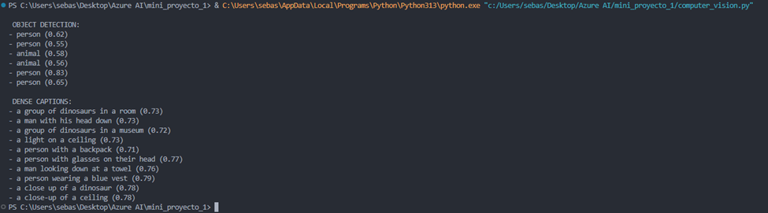

# Azure AI Vision Mini Project

## Project Overview

This mini project was developed as a hands-on practice to explore **Azure AI Vision (Computer Vision)** using the **REST API** and a **Python script**. The main goal was to understand how to interact programmatically with Azure's vision services, focusing on image analysis features commonly used in real-world applications.

The project demonstrates how to securely call Azure AI Vision endpoints, process image data, and interpret structured responses returned by the service.

---

## Objectives

* Practice using **Azure AI Vision REST API** 
* Implement image analysis using **Python**
* Explore advanced vision features such as:

  * **Common Object Detection**
  * **Dense Captioning**

---

## Features Implemented

### 1. Common Object Detection

The script detects common objects present in an image (e.g., people, vehicles, everyday items) and returns:

* Object label
* Confidence score

This feature is useful for applications such as inventory analysis, surveillance, and automated tagging.

---

### 2. Dense Captioning

Dense captioning provides **multiple localized descriptions** across different regions of an image. Instead of a single caption for the entire image, this feature generates:

* Short textual descriptions per region
* Confidence score for each caption

This allows a richer semantic understanding of visual content.

---

## Azure Resource Setup

An Azure AI Vision (Computer Vision) resource was created through the Azure Portal to enable image analysis.

This step provided the required **endpoint** and **API key**, which were later stored securely using environment variables.

---

## How It Works

1. The script loads environment variables from the `.env` file
2. An image is read locally as binary data
3. A POST request is sent to the Azure AI Vision `imageanalysis:analyze` endpoint
4. The request specifies the desired features:

   * `objects`
   * `denseCaptions`
5. The JSON response is parsed and results are printed to the console

---

## Sample Output

To validate the solution, two different test images were selected and analyzed using Azure AI Vision. The images were intentionally chosen to evaluate the service under different visual contexts.

### Test Images

* **Image 1:** A dog playing with its toy on the beach.

  * **Reason for selection:** This image was selected because of the difficulty it poses for artificial intelligence, given that the dog is in a complex position. 

* **Image 2:** Sculpture of four velociraptors with people in the background.

  * **Reason for selection:** This image was selected to verify the functionality of **Common Object Detection**, as it contains both dinosaurs and people.

### Results

**Image 1**
* **Object Detection** :
    * No objects were returned by the common object detection feature.
    * Although a dog is clearly present in the image, it was not detected. This is likely due to the complex position and pose of the dog, combined with surrounding elements such as grass and background objects that reduce contrast and clear object boundaries.

* **Dense Captioning:**
    * Despite the lack of detected objects, dense captioning successfully generated multiple localized descriptions, including:

        * A dog lying on grass

        * A green trash can on grass

        * A brick walkway with grass around it

        * Palm trees, tents, and beach-related elements

    * This demonstrates that dense captioning can still provide meaningful semantic understanding even when object detection does not perform as expected.

**Image 2**
* **Object Detection** :
    * Multiple instances of persons were correctly detected.
    * The system also classified dinosaurs as animals, showing its ability to generalize object categories, even when the subjects are representations rather than real animals.

* **Dense Captioning:**
    * The feature generated accurate region-based captions such as:

        * A group of dinosaurs in a room or museum

        * A person with a backpack

        * A person wearing glasses

        * Close-up descriptions of specific objects and regions

    * Overall, this image produced stronger results, likely due to a more controlled indoor environment with clearer object boundaries and lighting conditions.
---

## Cost Management Notice

> **Important:**
>
> The Azure AI Vision resource used for this project was **deleted after testing** in order to **avoid any ongoing or unintended charges**.
>
> The purpose of this project is educational and demonstrative. The source code remains fully functional and can be reused by creating a new Azure AI Vision resource and updating the environment variables accordingly.

---

## Author

**Sebastián Vargas Quesada**
Electrical Engineering Student – Computer & Network Emphasis

---
